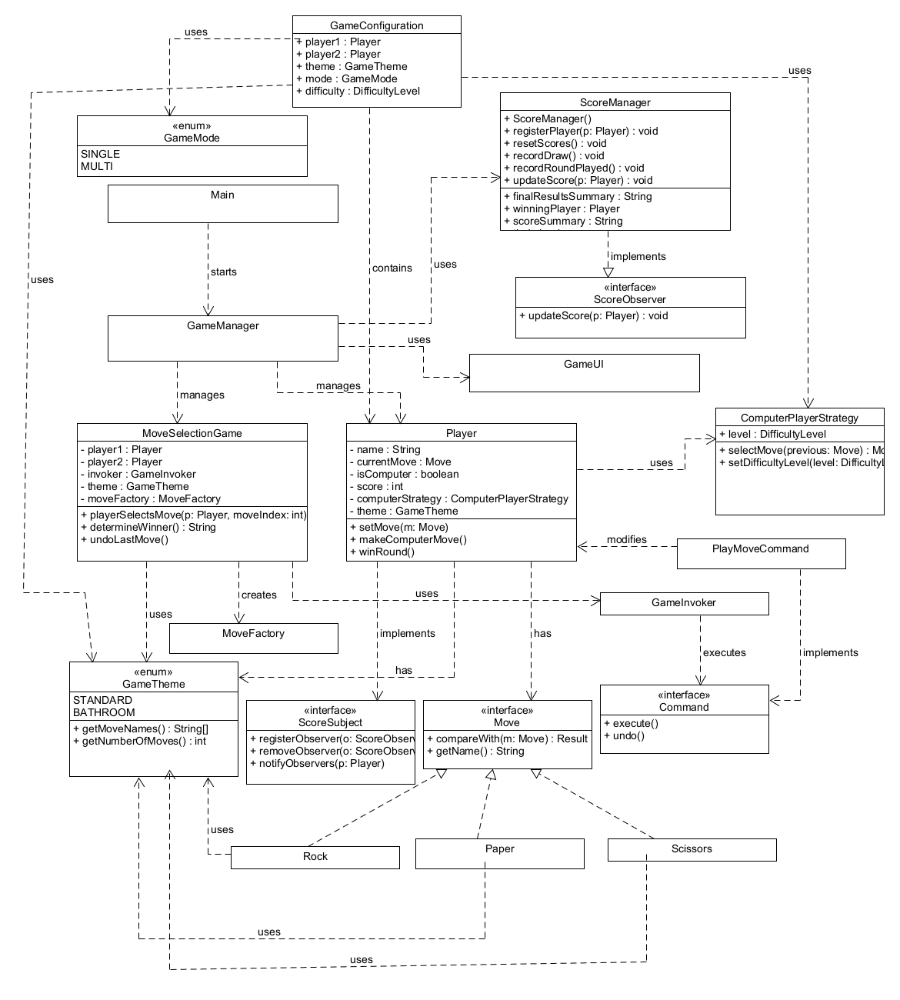

# Design Overview

This project follows the Observer pattern. Below is the UML class diagram:
## UML Class Diagram Overview
This class diagram represents a Rock-Paper-Scissors game application that incorporates several design patterns and object-oriented programming principles. Here's an overview of the main components:

### Core Game Components

MoveSelectionGame: Central game class that manages players, moves, and game flow
Player: Represents a game participant with attributes like name, score, and current move
Interface: Defines behavior for game moves with implementations like Rock, Paper, and Scissors
GameTheme: Enum that allows for different themes (STANDARD, BATHROOM) with custom move names

### Game Configuration

GameConfiguration: Stores settings like players, theme, mode, and difficulty
GameMode: Enum for SINGLE or MULTI player modes
DifficultyLevel: Controls AI difficulty (not fully visible in diagram)

### Design Patterns Implemented

Factory Pattern: MoveFactory creates different Move objects
Command Pattern: PlayMoveCommand, Command interface, and GameInvoker implement command pattern for move execution
Observer Pattern: ScoreSubject interface and ScoreObserver track score changes
Strategy Pattern: ComputerPlayerStrategy handles AI move selection with different difficulty levels

### Game Flow Management

GameManager: Coordinates overall game flow
ScoreManager: Tracks and updates player scores, implements ScoreObserver
GameUI: Handles user interface (details not shown in diagram)
Main: Application entry point

The diagram shows a well-structured object-oriented design that separates concerns appropriately: game logic, player management, move handling, and UI are decoupled. 
The use of design patterns makes the code flexible and extensible - new move types, themes, or strategies could be added with minimal changes to existing code.

